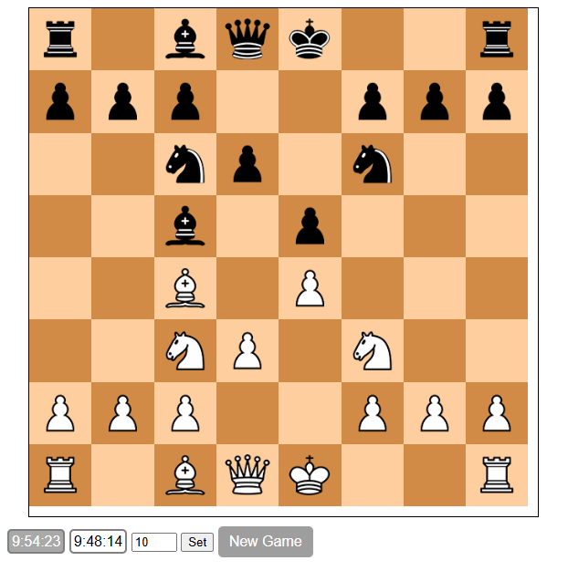

# Chess

Live Demo: https://artz1234.github.io/Chess/

A two-player chess game written in JavaScript, HTML, and CSS. 
 
This project utilizes the open source chess engine from [Mshvarts](https://github.com/mshvarts/Chess)

View at: https://mshvarts.github.io/Chess/

The edits in the first commit are seperated in: https://github.com/Artz1234/Collection/tree/main/Chess-master

### Screenshot:  
